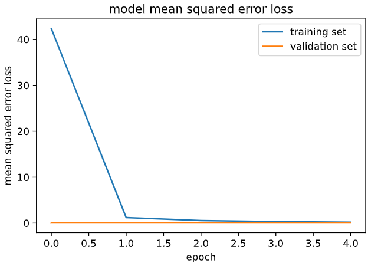

# Behavioral Cloning for Self Driving

[](http://www.udacity.com/drive)

## Overview

The goal of this project is to apply deep learning principle to behavioral cloning of self-driving car. The convolutional neural network predicts the steering angle from the road image taken from the camera attached to the car. The keys to the successful model in this project are to collect proper data and devise strategies of training, so that your model can efficiently learn how you drive.

---

## Project Files

My project includes the following files:
* `model.py` containing the script to create and train the model
* `drive.py` for driving the car in autonomous mode
* `pipeline.ipynb` visualizing each step of `model.py`
* `model.h5` containing a trained convolution neural network 
* `README.md` summarizing the results
* `videos` containing the videos of simulated car driven by the trained network.

Dependencies:
- python 3.7.0
- tensorflow-gpu 1.15.0
- keras 2.3.1
- python-engineio 3.13.2
- python-socketio 4.6.1

Using the [Udacity provided simulator](https://github.com/udacity/self-driving-car-sim) and my `drive.py` file, the car can be driven autonomously around the track by executing 
```sh
python drive.py model.h5
```

The `model.py` file contains the code for training and saving the convolution neural network. The pipeline I used for training and validating the model is describe in `pipeline.ipynb`. It contains comments to explain how each process works.

## Model Architectures

### 1. Network Description
I used the well-known model designed by Nvidia. This network consists 5 convolutional layers and 4 fully-connected layers. The input of this model is `66x200x3` image and the output is a single scalar steering value. The model includes ReLUs layers. 


The network takes inputs with size of 66x200x3. However the image captured from the simulator is `160x360`. Thus, I attached the pre-processing layers provided by keras at the front of this model. The first pre-processing layer crops top and bottom pixels to remove irrelevant information for training. The second layer resizes the image to `66x200`. The third one normalizes the value of [0, 255] within the range of [-1, 1].


Resizing the input is important as larger input will require the model with more parameters if filter sizes are left unchanged, eventually taking more resources to train. The original nvidia network I used has parameters of `252,219`. Without resizing, the number of parameters will increase to `981,819`.

### 2. Experiments on Dropout
I've tried training my network with dropout layers with keep probability of `0.5`, between each convolution and fully-connected network. However, after 5 epochs the result was not like as expected. The graph below is the loss graph by epoch. There seems to be no relation between training error and validation error. 



In actual run, my network failed to catch any information and the car kept going straight. It never did any steering. Thus, I removed the dropouts and it worked much better.

### 3. Model parameter tuning
For training, Adam optimizer with default hyperparameters and mean squared error(MSE) were used.

## Training Strategy

### 1. Collecting Data
The raw dataset I used contains four driving case:
- Default data provided by Udacity
- One lap focusing on keeping center
- One lap of driving reverse
- One lap of recovery driving from the sides

Each image of dataset is labeled with its steering measurement as below.


### 2. Data Distribution
Most of initial dataset were the images labeled going straight. The network trained with this is heavily biased toward, not being able to make sharp turns. The total number of samples are 10699.


The data distribution needed to be uniform. I produced a histogram of the steering measurements and calculated the average number of samples per bin. If the number of samples is above average, the samples are dropped with the keep probability of `(avg_sample_per_bin / num_samples_of_bin)`. The flattened data distribution is as follows. The total number of samples are 3317.


### 3. Data Augumentation
Dataset of 3317 images is not quite enough for training. Thus it is required to generate more data. I utilized the left and right camera images, biasing the steering measurement by `0.23`, then flipped all three images and measurements. The total number of samples are increased to `19902`.


## Result

I trained the model with the batch size of `32` for `5` epochs. The training result was as the graph below.


This model was able to drive whole track without collision or going off the road. What's really impressing was that it was strongly making its turn to recover when I intervened to drive the car off the track intentionally!

 